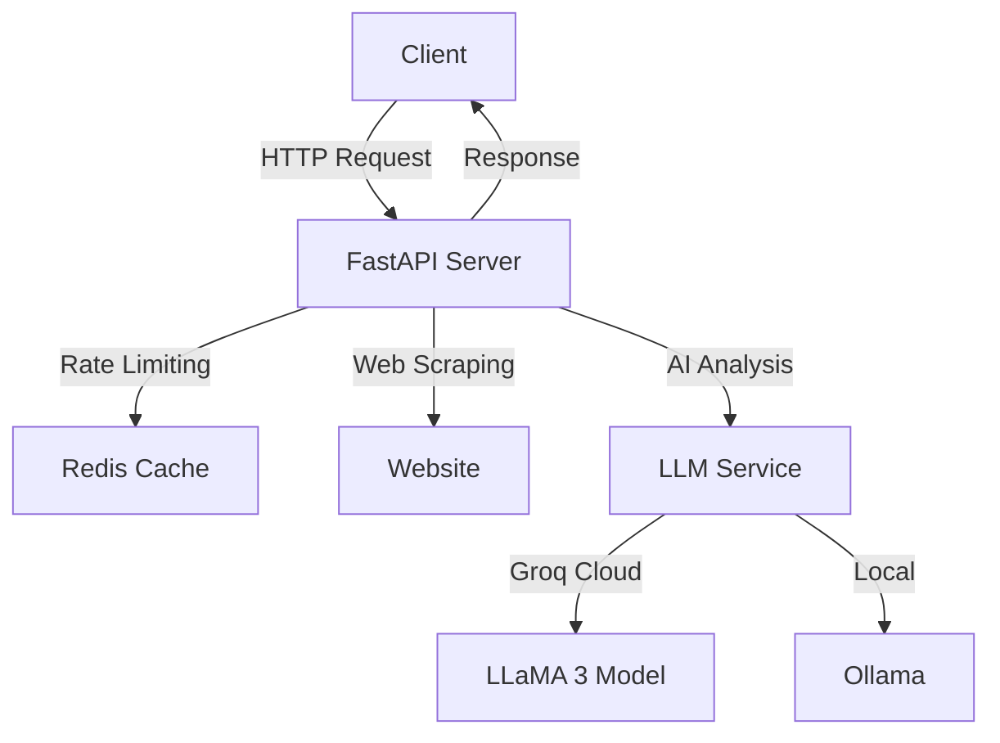

# AI Business Insights Agent

A high-performance FastAPI application that acts as an AI-powered agent for extracting, synthesizing, and interpreting key business insights from website homepages. This application leverages cutting-edge web scraping techniques and advanced AI models to analyze website content, providing structured, real-time information about companies and enabling conversational interaction.

**Deployed URL**: [https://fastapi-web-agent.onrender.com]

## Architecture



## Technology Stack

- **FastAPI**: High-performance web framework for building APIs with Python
- **Redis**: In-memory data store for rate limiting and caching
- **BeautifulSoup4**: Web scraping and HTML parsing
- **LLaMA 3**: Advanced language model for content analysis and conversation
- **Groq**: High-performance LLM inference platform
- **Ollama**: Local LLM deployment option

## Features

1. **Website Analysis & Initial Extraction**
   - Extracts core business details (industry, size, location, etc.)
   - Identifies unique selling propositions
   - Analyzes target audience and products/services
   - Performs sentiment analysis
   - Answers custom questions about the website

2. **Conversational Interaction**
   - Natural language follow-up questions
   - Context-aware responses
   - Conversation history tracking
   - Multi-turn dialogue support

## Setup & Installation

1. Clone the repository:
   ```bash
   git clone https://github.com/yourusername/ai-business-insights-agent.git
   cd ai-business-insights-agent
   ```

2. Create and activate a virtual environment:
   ```bash
   python -m venv venv
   source venv/bin/activate  # On Windows: venv\Scripts\activate
   ```

3. Install dependencies:
   ```bash
   pip install -r requirements.txt
   ```

4. Set up environment variables:
   ```bash
   cp .env.example .env
   # Edit .env with your configuration
   ```

5. Start Redis (required for rate limiting):
   ```bash
   # Using Docker
   docker run -d -p 6379:6379 redis
   ```

6. Run the application:
   ```bash
   uvicorn agent_server:app --reload
   ```

## API Usage

### 1. Website Analysis

```bash
curl -X POST "http://localhost:8000/analyze" \
     -H "Authorization: Bearer YOUR_SECRET_KEY" \
     -H "Content-Type: application/json" \
     -d '{
           "url": "https://example.com",
           "questions": [
             "What is their primary business model?",
             "Who is their target market?"
           ]
         }'
```

### 2. Conversational Interaction

```bash
curl -X POST "http://localhost:8000/chat" \
     -H "Authorization: Bearer YOUR_SECRET_KEY" \
     -H "Content-Type: application/json" \
     -d '{
           "url": "https://example.com",
           "query": "What are their key features?",
           "conversation_history": [
             {
               "user_query": "What industry are they in?",
               "agent_response": "They are in the SaaS industry."
             }
           ]
         }'
```

## Deployment

The application is configured for deployment on Render.com. The `render.yaml` file includes configurations for both the FastAPI service and Redis instance.

1. Create a new Render account
2. Connect your GitHub repository
3. Set the required environment variables:
   - `API_SECRET_KEY`
   - `GROQ_API_KEY`
   - `REDIS_URL`

## Development

- **IDE**: VS Code with Python extension
- **Testing**: pytest (coming soon)
- **Code Style**: Black formatter, isort for imports
- **Type Checking**: mypy

## Contributing

1. Fork the repository
2. Create a feature branch
3. Commit your changes
4. Push to the branch
5. Create a Pull Request

## License

MIT License - see LICENSE file for details
